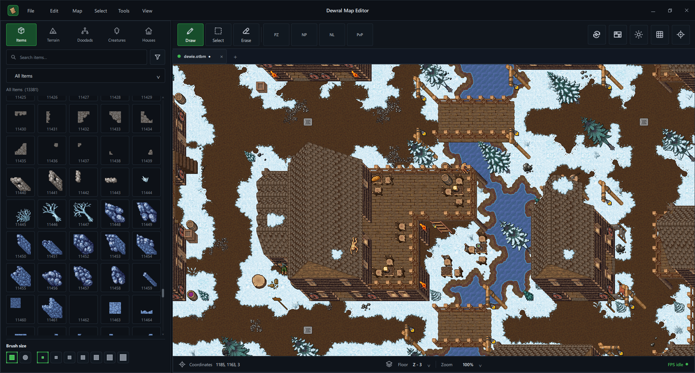
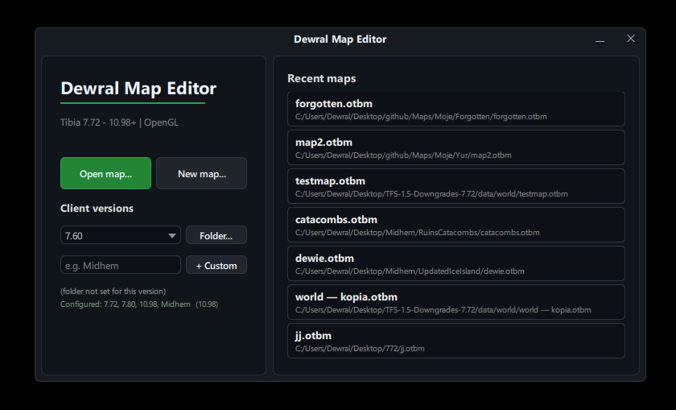

# Dewral Map Editor

Dewral Map Editor (DME) is a desktop OpenTibia map editor for OTBM maps. It
uses a Qt 6/QML interface and a custom OpenGL renderer designed for large,
multi-floor Tibia maps.

> Client assets are not included. DME requires your own `Tibia.dat`,
> `Tibia.spr`, and `items.otb` files. These files are copyrighted by CipSoft
> and must not be committed to this repository or included in a release.

<!-- SCREENSHOT SLOT: HERO
Save the main editor screenshot as docs/screenshots/editor-overview.png.
Recommended capture: 1600x900 or larger, GitHub theme, a map open, palette
visible, no private paths. Then replace this comment with:

-->

## Highlights

- Opens and saves OTBM maps for Tibia 7.72 through 10.98+ client profiles.
- Supports custom client profiles and remembers a separate asset directory for
  each profile.
- Uses an instanced OpenGL renderer with chunk caching, smooth pan and zoom,
  multiple visible floors, lighting preview, and optional item animations.
- Provides terrain, doodad, item, creature, house, and custom palettes.
- Includes ground brushes, automatic borders, wall brushes, doodad variants,
  zone tools, spawns, creatures, houses, and towns.
- Supports selection, multi-floor selection, moving items between floors,
  cut/copy/paste, undo/redo, item properties, search, and replacement tools.
- Includes an in-game preview mode for walking around the map. [ WIP ]
- Loads maps even when optional house and spawn sidecar files are absent.
- Produces a self-contained Windows release folder and ZIP archive.

## Screenshots

The following screenshot locations are intentionally reserved. Capture the
images described below and save them with the exact filenames. Full guidance
is available in [`docs/screenshots/README.md`](docs/screenshots/README.md).

<!-- SCREENSHOT SLOT: STARTUP
File: docs/screenshots/startup-client-profile.png
Alt text: DME startup window with a configured custom client profile
Markdown: 
-->

### Client profiles

Add `docs/screenshots/startup-client-profile.png` here.

<!-- SCREENSHOT SLOT: EDITING
File: docs/screenshots/brushes-and-palettes.png
Alt text: Editing terrain with brushes and item palettes in DME
Markdown: 
-->

### Brushes and palettes

Add `docs/screenshots/brushes-and-palettes.png` here.

<!-- SCREENSHOT SLOT: PREVIEW
File: docs/screenshots/ingame-preview.png
Alt text: Walking through an OTBM map in DME in-game preview mode
Markdown: 
-->

### In-game preview

Add `docs/screenshots/ingame-preview.png` here.

## Download and run

1. Download `DewralMapEditor-windows-x64.zip` from the
   [GitHub Releases page](https://github.com/dewral/DewralMapEditor/releases).
2. Extract the complete archive. Do not move `DME.exe` away from the DLL and
   `qml` folders shipped next to it.
3. Run `DME.exe`.
4. Select a client version or create a custom profile.
5. Point the profile at a directory containing:

   ```text
   Tibia.dat
   Tibia.spr
   items.otb
   ```

6. Open an OTBM map.

House and spawn XML sidecar files are optional. When present, DME loads them
with the map. When absent, the map still opens normally.

## Build on Windows without Qt Creator

The supported release build uses Visual Studio 2022, CMake, and a pinned vcpkg
manifest. Qt Creator and a separately installed Qt SDK are not required.

### Requirements

- Windows 10 or Windows 11, x64
- [Git for Windows](https://git-scm.com/download/win)
- [CMake 3.24 or newer](https://cmake.org/download/)
- Visual Studio 2022 Community or Build Tools 2022 with the
  **Desktop development with C++** workload
- An internet connection for the first dependency build

The first build downloads vcpkg and builds Qt 6.10.2. This can take a long time
and use significant disk space. Later builds reuse the local vcpkg binary
cache.

### One-command build

Clone the repository and run:

```powershell
.\build-release.bat
```

The script:

1. verifies Git, CMake, Visual Studio, and the MSVC C++ toolchain;
2. downloads the pinned vcpkg release into `.tools/vcpkg`;
3. installs the dependencies declared in `vcpkg.json`;
4. configures the `windows-vcpkg` CMake preset;
5. builds the Release configuration;
6. deploys only the required Qt runtime;
7. creates the production folder and ZIP archive.

Build output:

```text
release/
|-- DewralMapEditor-windows-x64/
|   |-- DME.exe
|   |-- data/
|   |-- qml/
|   |-- LICENSE
|   |-- NOTICE
|   |-- README.md
|   `-- required Qt runtime files
`-- DewralMapEditor-windows-x64.zip
```

Local custom profiles and client binaries are removed from the release
package automatically.

### Build from PowerShell

The batch file is only a convenient launcher. The same build can be started
directly:

```powershell
.\scripts\build-release.ps1
```

After vcpkg has been bootstrapped, the underlying commands are:

```powershell
$env:VCPKG_ROOT = "$PWD\.tools\vcpkg"
cmake --preset windows-vcpkg
cmake --build --preset windows-release
```

### Build with an existing Qt installation

Developers who already have a compatible Qt 6 SDK may use it directly:

```powershell
cmake -S . -B build/local-release -G Ninja `
  -DCMAKE_BUILD_TYPE=Release `
  -DCMAKE_PREFIX_PATH=C:/Qt/6.10.2/mingw_64

cmake --build build/local-release --target package_release --parallel
```

Use a compiler matching the selected Qt SDK. For example, a MinGW Qt package
must be built with the corresponding MinGW toolchain.

## Dependencies

The vcpkg manifest pins its registry baseline for repeatable dependency
resolution and installs:

- `qtbase`
- `qtdeclarative`
- `qtsvg`

The `qtbase` feature set is limited to the GUI, network, OpenGL, PNG and
deployment components used by DME. The pinned port set provides Qt 6.10.2.

The official Windows preset uses the release-only `x64-windows-release`
triplet to avoid compiling and storing an unused Debug copy of Qt. It targets
Visual Studio 2022. vcpkg manifest mode is activated through the CMake
toolchain specified in `CMakePresets.json`.

## Useful controls

| Action | Control |
|---|---|
| Toggle draw/select mode | `Space` |
| Change floor | `+` / `-` or `Ctrl` + mouse wheel |
| Zoom | Mouse wheel |
| Pan | Middle mouse button or arrow keys |
| Fast keyboard pan | `Shift` + arrow keys |
| Undo / redo | `Ctrl+Z` / `Ctrl+Shift+Z` |
| Copy / cut / paste | `Ctrl+C` / `Ctrl+X` / `Ctrl+V` |
| Rotate doodad variant | `R` |
| Go to position | `Ctrl+G` |
| Exit in-game preview | `Esc` |

While dragging an item, changing floors keeps the item attached to the cursor
and drops it on the active floor.

## Project structure

```text
DewralMapEditor/
|-- CMakeLists.txt             application and package targets
|-- CMakePresets.json          shareable Windows/vcpkg presets
|-- vcpkg.json                 pinned C++ dependency manifest
|-- build-release.bat          double-click release build
|-- scripts/
|   `-- build-release.ps1      validated command-line build
|-- cmake/                     Qt deployment and release packaging
|-- data/                      built-in brushes and palette definitions
|-- editor/
|   |-- core/                  application services and models
|   |-- map/                   editing, input, chunk cache, and renderer bridge
|   |-- qml/                   windows, components, controllers, and dialogs
|   `-- ui/                    bundled UI textures and icons
|-- libs/
|   `-- otformats/             DAT, SPR, OTB, OTFI, and OTBM readers
`-- docs/
    `-- screenshots/           README images supplied by the maintainer
```

## Troubleshooting

### Visual Studio C++ tools were not found

Open Visual Studio Installer, modify Visual Studio or Build Tools 2022, and
enable **Desktop development with C++**.

### CMake cannot find the vcpkg toolchain

Use `build-release.bat`, or set `VCPKG_ROOT` before configuring:

```powershell
$env:VCPKG_ROOT = "C:\path\to\vcpkg"
cmake --preset windows-vcpkg
```

### The first build appears to be stuck

Qt is being compiled by vcpkg. The first build is substantially slower than
normal DME rebuilds. Check CPU and disk activity before stopping it.

### Windows shows an old or missing application icon

Windows may cache executable icons. Refresh Explorer, rename the extracted
folder, or clear the Windows icon cache. The release executable contains a
native multi-size Windows icon.

## Data and credits

- DME is inspired by
  [Remere's Map Editor](https://github.com/hampusborgos/rme).
- Portions of the binary-format I/O implementation are derived from
  [Tibia ImGui Map Editor](https://github.com/Open-Tibia-Tools/tibia-imgui-map-editor),
  which is licensed under the GNU Affero General Public License v3.0.
- Lighting and in-game visualization ideas were also informed by Tibia ImGui
  Map Editor.
- Some brush, border, tileset, and creature definitions are derived from
  OpenTibia/RME-compatible data.
- Tibia is a trademark of CipSoft GmbH. Client data and artwork are not
  distributed with DME.

## License

Dewral Map Editor is free software licensed under the
[GNU Affero General Public License v3.0](LICENSE). See [NOTICE](NOTICE) for
third-party attribution.

Release binaries must be accompanied by access to the complete corresponding
source code for the same version. Tibia client files and artwork are not part
of this project and are not covered by this license.
